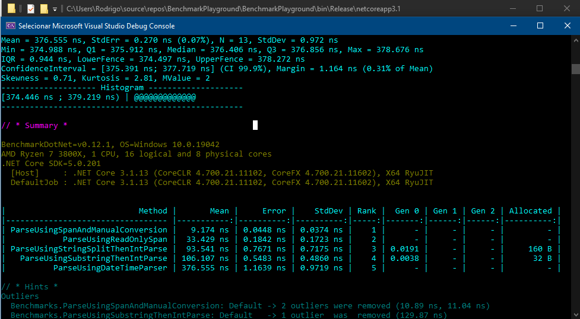

# BenchmarkPlayground
> Alguns exemplos interessantes de otimização de código.

Supondo que estamos desenvolvendo uma API de alta performance com o seguinte requisito não funcional: **"Esta API precisa responder sempre abaixo de 30 milissegundos".**
Neste cenário, cada nano segundo conta, então vamos verificar os benchmarks de alguns métodos escritos com abordagens diferentes, mas que chegam ao mesmo resultado.

O objetivo dos métodos testados é extrair, como int32, o ano de dentro de uma string que está no formato datetime iso. A string utilizada no exemplo é: "2021-04-15T00:20:53Z"

## Resultados do benchmark.

### A implementação metodos testados está em:
BenchmarkPlayground/DateParser.cs

## Minhas Conclusões

- Ao observar a implementação do método mais performático, fica claro que nem sempre clean code e high performance andam de mãos dadas. Neste cenário, o método mais legivel é o menos performático e o mais performático ***(42x mais rápido)*** é o menos legível. É preciso sempre avaliar se o custo de performance vale o custo de manutenção de um código. Provavelmente um dev iniciante não entenderá imediatamente o que está acontecendo na implementação de *UsingSpanAndManualConversion*().

- É importante termos curiosidade de testar diversas implementações com diferentes abordagens, mesmo para rotinas que parecem triviais. Um metodo que faz um simples parse de um datetime, se chamado milhões de vezes num curto espaço de tempo pode ter um grande impacto na performance do seu software, tanto no tempo necessário para sua de execução como no consumo de recursos de hardware.

- Pessoalmente, acho preferível escrever um código limpo e legível e deixar a otimização para quando necessário. Caso passe a ter problemas de performance, existem modificacões que podem ser feitas para otimizar o desempenho antes de transformar o código numa bagunça ininteligível.
